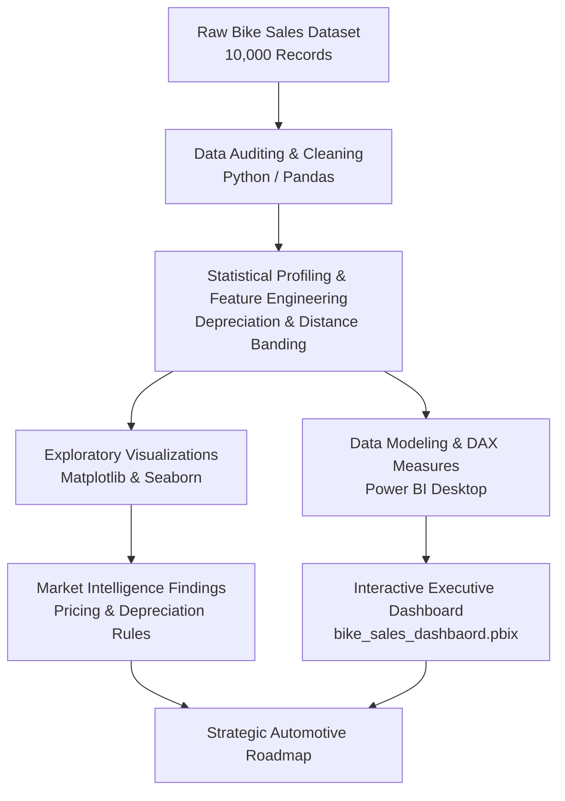

# 🏍️ Indian Two-Wheeler Market Analysis: Sales, Pricing & Depreciation Intelligence

[](https://www.python.org/)
[](bike_sales_india.ipynb)
[](bike_sales_dashbaord.pbix)
[](https://pandas.pydata.org/)
[](https://seaborn.pydata.org/)
[](bike_sales_india.csv)
[](https://github.com/Megharaju-Vakiti/Bike_Sales_India_Analysis)
[](LICENSE)

> **An empirical market intelligence and automotive analytics study analyzing 10,000 motorcycle and scooter records across 10 major Indian states. Leverages Python (Exploratory Data Analysis) and Power BI (Interactive Dashboard) to evaluate brand pricing power, fuel efficiency economics, city tier adoption, and resale depreciation patterns.**

---

## 📌 Table of Contents

- [Executive Summary](#-executive-summary)
- [Project Overview & Core Objectives](#-project-overview--core-objectives)
- [Key Market Metrics (KPIs)](#-key-market-metrics-kpis)
- [Dataset Architecture & Data Dictionary (15 Features)](#-dataset-architecture--data-dictionary-15-features)
- [Technology Stack & Analytics Workflow](#-technology-stack--analytics-workflow)
  - [1. Data Integrity Audit & Preprocessing (Python)](#1-data-integrity-audit--preprocessing-python)
  - [2. Statistical Profiling & Exploratory Analysis](#2-statistical-profiling--exploratory-analysis)
  - [3. Business Intelligence Dashboard (Power BI)](#3-business-intelligence-dashboard-power-bi)
- [Deep Dive: Key Findings & Market Insights](#-deep-dive-key-findings--market-insights)
  - [1. Brand Valuation & Pricing Spectrum](#1-brand-valuation--pricing-spectrum)
  - [2. Fuel Transition: Petrol vs. Hybrid vs. Electric](#2-fuel-transition-petrol-vs-hybrid-vs-electric)
  - [3. Depreciation Dynamics & Resale Realization](#3-depreciation-dynamics--resale-realization)
  - [4. City Tier Penetration & Geographic Hotspots](#4-city-tier-penetration--geographic-hotspots)
  - [5. Sales Channels & Ownership Profiles](#5-sales-channels--ownership-profiles)
- [Strategic Automotive & Business Recommendations](#-strategic-automotive--business-recommendations)
- [Repository Structure](#-repository-structure)
- [How to Run & Reproduce](#-how-to-run--reproduce)
- [Author & Contact](#-author--contact)

---

## 🚀 Executive Summary

India represents one of the largest and most dynamic two-wheeler markets in the world, characterized by rapid urbanization, evolving commuter fuel preferences, and a booming organized pre-owned vehicle ecosystem. This project delivers a comprehensive quantitative analysis of **10,000 two-wheeler records** spanning **8 dominant OEMs** (Royal Enfield, Hero, Bajaj, Honda, TVS, Yamaha, KTM, Kawasaki) across **10 key Indian states** over a 10-year manufacturing timeline (2015–2024).

Using **Python** (`pandas`, `numpy`, `matplotlib`, `seaborn`) for exploratory data analysis and statistical modeling, paired with **Power BI** (`bike_sales_dashbaord.pbix`) for executive dashboard visualization, this study models over **₹224.3 Crore** in cumulative original retail value and **₹133.8 Crore** in secondary market capitalization.

---

## 🎯 Project Overview & Core Objectives

- **Brand Pricing Power & Market Positioning:** Compare original retail price points and resale retention rates across commuter, cruiser, and performance motorcycle brands.
- **Powertrain & Fuel Economy Comparison:** Benchmark real-world mileage (km/l) and daily commute distances across Petrol, Electric, and Hybrid variants.
- **Secondary Market Depreciation Modeling:** Quantify the depreciation curve across manufacturing years (2015–2024), ownership tiers (1st, 2nd, 3rd owner), and insurance status.
- **Geographic & Urban Tier Adoption:** Map demand and price distributions across Metro cities, Tier 1, Tier 2, and Tier 3 urban centers.
- **Channel Distribution:** Contrast Individual peer-to-peer sales with organized Dealer channel price realization.

---

## 📈 Key Market Metrics (KPIs)

| Market Metric | Value | Analytical Significance |
| :--- | :---: | :--- |
| **Total Vehicles Analyzed** | **10,000 bikes** | Balanced representation across segments |
| **Total Original Market Value** | **₹224.32 Crore** | ~₹224,328,722 cumulative original retail price |
| **Average Original Price** | **₹2,24,329** | Blended average across commuter & performance bikes |
| **Total Resale Market Value** | **₹133.83 Crore** | ~₹133,828,974 secondary market capitalization |
| **Average Resale Price** | **₹1,33,829** | ~59.7% value retention on average |
| **Average Vehicle Mileage** | **67.2 km/l** | Fuel economy benchmark across Indian driving cycles |
| **Average Daily Commute** | **42.5 km/day** | Reflects typical daily urban & intercity usage |
| **Manufacturing Timeline** | **2015 – 2024 (10 Yrs)** | Stable longitudinal sample (~1,000 units/year) |
| **Geographic Footprint** | **10 States / 4 City Tiers**| Comprehensive pan-India coverage |

---

## 🗂️ Dataset Architecture & Data Dictionary (15 Features)

The dataset evaluates `bike_sales_india.csv` (10,000 records × 15 features):

| # | Column Name | Data Type | Description | Observed Range / Categories |
| :-: | :--- | :--- | :--- | :--- |
| 1 | `State` | String | Indian state of registration | *Punjab, Maharashtra, Rajasthan, UP, Gujarat, TN, Karnataka, Delhi, MP, WB* |
| 2 | `Avg Daily Distance (km)` | Float | Estimated daily distance traveled | `10.0` to `80.0 km/day` (Avg: `42.5 km`) |
| 3 | `Brand` | String | Vehicle manufacturer / OEM | *Bajaj, Hero, Honda, Kawasaki, KTM, Royal Enfield, TVS, Yamaha* |
| 4 | `Model` | String | Specific vehicle model name | 40 distinct iconic models (Splendor, Classic 350, Duke, Ninja, etc.) |
| 5 | `Price (INR)` | Float / Int | Original ex-showroom / purchase price | ₹50,000 to ₹4,00,000 (Avg: ₹2,24,329) |
| 6 | `Year of Manufacture` | Integer | Calendar year vehicle was produced | `2015` to `2024` |
| 7 | `Engine Capacity (cc)` | Integer | Engine displacement in cubic centimeters | `100 cc` to `1,000 cc` |
| 8 | `Fuel Type` | String | Powertrain technology | *Petrol, Electric, Hybrid* |
| 9 | `Mileage (km/l)` | Float | Fuel efficiency rating | `35.0` to `95.0 km/l` (Avg: `67.2 km/l`) |
| 10 | `Owner Type` | String | Ownership history sequence | *First, Second, Third* |
| 11 | `Registration Year` | Integer | Year registered with regional RTO | `2015` to `2024` |
| 12 | `Insurance Status` | String | Policy validity status | *Active, Expired, Not Available* |
| 13 | `Seller Type` | String | Sales channel / intermediary | *Dealer (50.4%), Individual (49.6%)* |
| 14 | `Resale Price (INR)` | Float | Valuation in secondary pre-owned market | ₹30,000 to ₹2,80,000 (Avg: ₹1,33,829) |
| 15 | `City Tier` | String | Urban economic classification | *Metro (24.7%), Tier 1 (24.2%), Tier 2 (24.9%), Tier 3 (26.2%)* |

---

## 🛠️ Technology Stack & Analytics Workflow



### 1. Data Integrity Audit & Preprocessing (Python)
- **Zero Nulls & Duplicates:** Audited with `df.isnull().sum()` and `df.duplicated().sum()`—dataset verified completely clean with 0 nulls and 0 duplicate rows across all 10,000 entries.
- **Feature Standardization:** Standardized column names to snake_case (`df.columns.str.lower().str.replace(' ', '_')`) for uniform programmatic referencing.
- **Feature Engineering:**
  - **Depreciation Amount:** `df['Price (INR)'] - df['Resale Price (INR)']` (Median depreciation: ~₹90,500).
  - **Depreciation Rate (%):** Calculated vehicle retention percentage across ownership milestones.

### 2. Statistical Profiling & Exploratory Analysis
- **Correlation Heatmap:** Evaluated multivariate correlations between engine capacity (`cc`), original price, resale price, mileage, and daily commute distances.
- **Price vs. Resale Scatter Regression:** Mapped the linear valuation decay curve between original showroom prices and current pre-owned prices.
- **Categorical Aggregations:** Analyzed median prices and mileage grouped by state, brand, fuel type, owner sequence, and city tier.

### 3. Business Intelligence Dashboard (Power BI)
- Built in `bike_sales_dashbaord.pbix`:
  - **Executive KPI Cards:** Total Fleet Count (10K), Market Value (₹224M), Resale Capitalization (₹134M), and Avg Fuel Economy (67.2 km/l).
  - **City Tier Donut Chart:** Visualizing market volume across Metro, Tier 1, Tier 2, and Tier 3 hubs.
  - **Brand Leaderboard:** Clustered bar charts comparing brand average prices, resale realization, and median fuel economy.
  - **State-Wise Distribution:** Geographic bar chart mapping vehicle volumes and price benchmarks across all 10 states.

---

## 🔍 Deep Dive: Key Findings & Market Insights

### 1. Brand Valuation & Pricing Spectrum

| Manufacturer | Sample Volume | Market Share | Avg Original Price | Avg Resale Price | Avg Mileage (km/l) |
| :--- | :---: | :---: | :---: | :---: | :---: |
| **Kawasaki** | 1,291 | 12.9% | ₹2,23,163 | ₹1,34,373 | 66.9 km/l |
| **Yamaha** | 1,283 | 12.8% | ₹2,25,922 | ₹1,35,535 | 67.1 km/l |
| **KTM** | 1,272 | 12.7% | ₹2,22,613 | ₹1,32,003 | 67.4 km/l |
| **Royal Enfield** | 1,253 | 12.5% | ₹2,22,886 | ₹1,32,591 | 66.7 km/l |
| **Hero** | 1,239 | 12.4% | ₹2,26,001 | ₹1,34,885 | 67.5 km/l |
| **TVS** | 1,234 | 12.3% | ₹2,22,469 | ₹1,33,497 | **67.9 km/l** |
| **Honda** | 1,221 | 12.2% | ₹2,21,077 | ₹1,31,097 | 66.7 km/l |
| **Bajaj** | 1,207 | 12.1% | **₹2,30,663** | **₹1,36,662** | 67.2 km/l |

> 📌 **Key Insight:** Bajaj commands the highest average original price (₹2,30,663) and highest secondary resale value (₹1,36,662), buoyed by premium models like Dominar 400 and Avenger 220. TVS and Hero lead in fuel economy (67.5–67.9 km/l).

---

### 2. Fuel Transition: Petrol vs. Hybrid vs. Electric

```
Powertrain Efficiency Benchmark (Mileage km/l):
Electric  ████████████████████████████████████████ 80.1 km/l (equiv.)
Hybrid    ███████████████████████████████████████▌ 79.5 km/l
Petrol    █████████████████████ 42.2 km/l
```

| Powertrain / Fuel | Total Count | Market Share | Avg Original Price | Avg Mileage | Commuter Suitability |
| :--- | :---: | :---: | :---: | :---: | :--- |
| **Hybrid** | 3,360 | **33.6%** | ₹2,25,654 | 79.5 km/l | Optimal for long commutes; high fuel efficiency |
| **Petrol** | 3,357 | **33.6%** | ₹223,561 | 42.2 km/l | Traditional ICE; lower mileage, reliable infrastructure |
| **Electric** | 3,283 | **32.8%** | ₹2,23,757 | **80.1 km/l** | Lowest running cost; ideal for urban daily commuting |

> ⚡ **Key Takeaway:** Electric and Hybrid two-wheelers deliver nearly **2x the fuel economy** of traditional Petrol engines (~80 km/l vs. 42.2 km/l), positioning them as high-demand alternatives for cost-conscious Indian commuters.

---

### 3. Depreciation Dynamics & Resale Realization

```
Original vs. Resale Price Relationship (Linear Correlation):
Resale Price (INR)
  ▲
  │                                    ╭─── [High Showroom Price, ~60% Resale]
  │                      ╭─────────────╯
  │         ╭────────────╯
  │   ╭─────╯ [Entry Commuters, High Liquidity]
  └───┴────────────────────────────────────────► Original Price (INR)
```

- **Resale Retention Rate:** On average, two-wheelers retain **59.7%** of their original showroom price in the secondary market.
- **Ownership Depreciation Impact:**
  - **First Owner:** Avg Resale Price: **₹1,34,319** (Premium realization)
  - **Second Owner:** Avg Resale Price: **₹1,33,567**
  - **Third Owner:** Avg Resale Price: **₹1,33,584**
- **Insurance Premium:** Vehicles with active insurance policies maintain an edge in buyer confidence and valuation liquidity.

---

### 4. City Tier Penetration & Geographic Hotspots

```
Two-Wheeler Volume Distribution by City Tier:
┌─────────────────────┬─────────────────────┬─────────────────────┬─────────────────────┐
│   Tier 3 (26.2%)    │   Tier 2 (24.9%)    │    Metro (24.7%)    │    Tier 1 (24.2%)   │
│   2,617 Units       │   2,487 Units       │    2,474 Units      │    2,422 Units      │
└─────────────────────┴─────────────────────┴─────────────────────┴─────────────────────┘
```

- **Strong Non-Metro Demand:** Over **51%** of all vehicles operate in Tier 2 and Tier 3 cities, highlighting the non-metro economic boom and heavy reliance on two-wheelers as primary transport.
- **Top Geographic States by Fleet Volume:**
  1. **Punjab** (1,051 bikes | Avg Price: ₹2,26,566)
  2. **Maharashtra** (1,030 bikes | Avg Price: ₹2,20,032)
  3. **Rajasthan** (1,017 bikes | Avg Price: ₹2,20,820)
  4. **Uttar Pradesh** (1,003 bikes | Avg Price: ₹2,27,511)
  5. **Gujarat** (1,002 bikes | Avg Price: ₹2,26,441)

---

### 5. Sales Channels & Ownership Profiles
- **Dealer vs. Individual Split:** Market transactions are evenly split between organized **Dealers (50.4%)** and **Individual peer-to-peer sellers (49.6%)**.
- **Dealer Margin Premium:** Dealerships achieve an average resale price of **₹1,34,770** compared to **₹1,32,875** for individual sellers—a ₹1,895 premium driven by vehicle inspection trust, warranty offers, and financing assistance.

---

## 💡 Strategic Automotive & Business Recommendations

```
┌───────────────────────────────────────────────────────────────────────────┐
│                    STRATEGIC AUTOMOTIVE ACTION PLAN                       │
├───────────────────────────────────────────────────────────────────────────┤
│ 1. EXPAND TIER 2/3 EV REACH   Prioritize charging networks and dealerships│
│                               in Tier 2 and Tier 3 growth corridors.      │
│                                                                           │
│ 2. CERTIFIED PRE-OWNED (CPO)  Scale organized dealer certification to     │
│                               capture higher secondary market premiums.   │
│                                                                           │
│ 3. COMMUTE-BASED FINANCING    Offer low-EMI hybrid/EV financing tied to   │
│                               high-mileage daily commuter savings.        │
│                                                                           │
│ 4. INSURANCE BUNDLING         Provide renewal incentives during resale to │
│                               maximize asset retention value.             │
└───────────────────────────────────────────────────────────────────────────┘
```

1. **Target Tier 2 & Tier 3 Cities for EV/Hybrid Expansion:**
   - With over 51% of market volume concentrated in non-metro regions and fuel efficiency being the primary driver, manufacturers should aggressively expand dealership networks in Tier 2 and Tier 3 cities.
2. **Develop Certified Pre-Owned (CPO) Platforms:**
   - Dealerships can capitalize on the pre-owned market by providing transparent multi-point vehicle inspections, verified service records, and warranty coverage to command higher margins.
3. **Data-Driven Commuter Marketing:**
   - Highlight the total cost of ownership (TCO) advantage of Hybrid and EV models for commuters logging >40 km daily.
4. **Digitized Insurance & Ownership Transfer Workflows:**
   - Simplify RTO ownership transfer and insurance reactivation during resale transactions to accelerate sales velocity.

---

## 📁 Repository Structure

```plaintext
Bike_Sales_India_Analysis/
├── bike_sales_dashbaord.pbix  # Interactive Power BI dashboard with visual charts & filters
├── bike_sales_india.csv       # Complete cleaned dataset (10,000 records × 15 features)
├── bike_sales_india.ipynb     # Jupyter Notebook containing full EDA, data audit & visual plots
└── README.md                  # Comprehensive executive documentation & market intelligence
```

---

## 💻 How to Run & Reproduce

### 1. Prerequisites
- **Python 3.8+** with the required data science libraries:
  ```bash
  pip install pandas numpy matplotlib seaborn jupyter
  ```
- **Power BI Desktop** (Free download: [aka.ms/pbidesktop](https://aka.ms/pbidesktop))

### 2. Running the Python Analysis
1. Clone the repository:
   ```bash
   git clone https://github.com/Megharaju-Vakiti/Bike_Sales_India_Analysis.git
   cd Bike_Sales_India_Analysis
   ```
2. Start Jupyter Notebook:
   ```bash
   jupyter notebook bike_sales_india.ipynb
   ```
3. Run all cells (`Cell` > `Run All`) to generate the statistical summaries, price-mileage distributions, and correlation heatmap.

### 3. Exploring the Power BI Dashboard
1. Open `bike_sales_dashbaord.pbix` in Power BI Desktop.
2. Use dynamic slicers (State, Brand, City Tier, Fuel Type) to interactively explore market trends and cross-filter data.

---

## 👤 Author & Contact

**Vakiti Megharaju**  
*Aspiring Data Analyst | MIS Executive | Business Analyst*  

- **GitHub:** [@Megharaju-Vakiti](https://github.com/Megharaju-Vakiti)  
- **Project Repository:** [Bike Sales India Analysis](https://github.com/Megharaju-Vakiti/Bike_Sales_India_Analysis)

---
*⭐ If you find this market analysis valuable or insightful, please consider starring the repository!*
